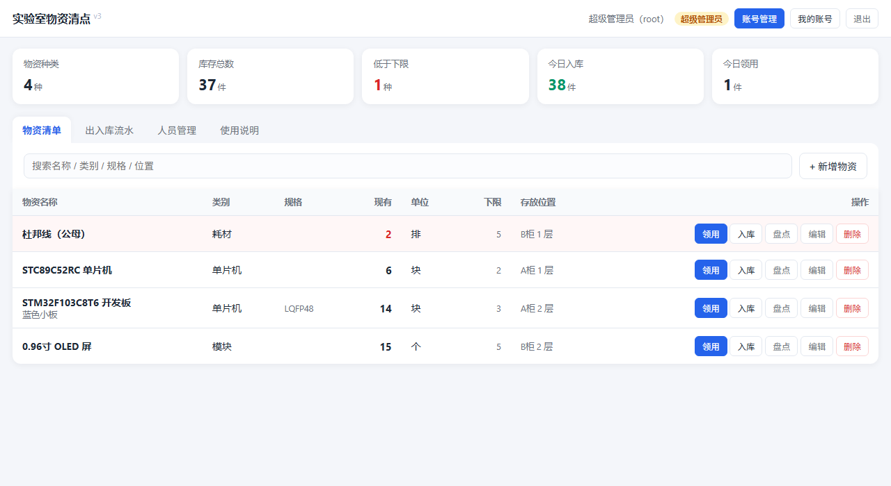

# 实验室物资清点小程序（单机网页版）

记录实验室里有多少物资（单片机、元器件、耗材……），什么时候入库了多少、什么时候被领走了多少，
每一笔都留下**时间 + 操作人 + 变动前后数量**，并且只有登录后的人才能录数据、改数据。



**特点**

- 零依赖：后端只用 Node.js 标准库，不用 `npm install`，双击 `启动.bat` 就能用
- 手机可用：电脑和手机连同一个 WiFi，手机浏览器打开就能用（界面自适应竖屏）
- 三级权限：超级管理员 / 管理员 / 普通成员，权限在后端卡死，绕过界面也改不了数据
- 每笔流水都有留痕，可按物资、类型、日期、关键字查询并导出 Excel(CSV)
- 数据即时落盘 + 每次启动自动备份，不怕断电、不怕误删

## 一、怎么运行

1. 双击 **`启动.bat`**（不需要安装任何东西，Node.js 和 Python 一个都没有时才需要装）。
   - 浏览器会自动打开 `http://127.0.0.1:8000/`
   - 想关掉服务，就把那个黑色命令行窗口关掉
2. 登录：**账号 admin**，密码是**你自己设置的那个**。
   - 如果是全新的、还没有 `data` 文件夹的第一次运行，默认密码是 `admin123`，登录后请立刻改掉。
   - 万一忘记管理员密码：关掉服务，把 `data/db.json` 删掉再启动，就能用 `admin / admin123` 重新开始
     （注意这会清空全部物资和流水，所以平时请留好 `data` 文件夹的备份）。

> 不需要联网、不需要安装任何第三方库。程序自带两个版本：
> `server.js`（Node 版，优先使用）和 `lab_inventory.py`（Python 版备选），
> `启动.bat` 会自动挑一个能跑的。

### 用手机访问（同一个 WiFi）

`启动.bat` 已经带了局域网参数，启动时命令行会打印一行：

```
局域网访问: http://192.168.x.x:8000/   （手机连同一个 WiFi 可打开）
```

手机浏览器输入这个地址就能用。若连不上，多半是 Windows 防火墙拦了，在弹窗里选「允许访问」即可。

## 二、日常怎么用

| 场景 | 操作 |
| --- | --- |
| 实验室新买/新到货 | 物资清单里点物资的 **入库**，填数量，备注写采购单号 |
| 有人拿走一块单片机 | 点 **领用**，填 1，备注写"谁领走、用在哪" |
| 实物和系统数字对不上 | 点 **盘点**，直接填实际数量，系统记录变动前后 |
| 新物资第一次登记 | 右上角 **+ 新增物资**（管理员） |
| 查某天/某人干了什么 | 「出入库流水」标签页，按物资、类型、日期、关键字筛选 |
| 导出交给老师 | 「出入库流水」→ **导出 Excel(CSV)** |
| 加一个新同学 | 「人员管理」→ **+ 新增人员**（管理员） |

低于「库存下限」的物资在清单里会**标红**，方便提前补货。

## 三、权限设计（其他人改不了）

| 能力 | 超级管理员 | 管理员 | 普通成员 |
| --- | :---: | :---: | :---: |
| 查看物资、查流水、看统计、导出 CSV | ✅ | ✅ | ✅ |
| 录入入库 / 领用 / 盘点 | ✅ | ✅ | ❌ **只能看** |
| 新增、编辑、删除物资 | ✅ | ✅ | ❌ |
| 新增普通成员 | ✅ | ✅ | ❌ |
| **新增管理员 / 升降任何人的角色** | ✅ | ❌ | ❌ |
| **管理其他管理员账号**（改密码、停用、删除） | ✅ | ❌ | ❌ |
| 停用 / 删除普通成员 | ✅ | ✅ | ❌ |
| 清理流水记录 | ✅ | ❌ | ❌ |
| 改自己的姓名 / 登录账号 / 密码 | ✅ | ✅ | ✅ |

**权限是三层向下的**：超级管理员管所有人 → 管理员只管普通成员 → 普通成员只能看。

> 普通成员是**纯查看**账号：打开物资清单，操作列显示「只读」，没有入库/领用/盘点按钮。
> 管理员**不能给自己人升管理员**，这条在后端卡死：越权调用会返回 403，不是靠界面藏按钮。
> 就算有人绕过界面直接调接口，也一样录不进去、升不了权。

**可以有多个管理员，但只有超级管理员（root）能造管理员**（都在「人员管理」页，这个标签页只有管理员看得到）：

1. 用 **root** 登录 → 点 **+ 新增人员** → 「角色」选 **管理员**；
2. 或者用 **root** 对某个成员点 **设为管理员**，就地升级（点 **设为成员** 可以降回来）。

**普通管理员**（比如实验室负责的同学）在这一页只能：

- 新增 **普通成员**（角色栏是灰的，写明"你新增的都是普通成员"）；
- 改普通成员的姓名 / 登录账号 / 密码，停用或删除普通成员；
- 别的管理员和 root 那几行，按钮全是灰的，点不动。

（如果登录后**看不到「人员管理」这个标签**，说明你当前是普通成员，换个管理员账号登录即可。）

**改账号信息：**

| 想做什么 | 在哪做 |
| --- | --- |
| 改别人的**登录账号 / 姓名 / 密码 / 角色** | 「人员管理」→ 该行点 **编辑** |
| 快速把某人升/降为管理员 | 「人员管理」→ 该行点 **设为管理员 / 设为成员** |
| 停用（禁止登录）某人 | 「人员管理」→ 该行点 **停用** |
| 改**自己**的登录账号 / 姓名 / 密码 | 右上角 **我的账号** |

登录账号要求：2-32 位，只能用字母、数字或 `_ . @ -`，且不能和别人重复。

每个管理员权限完全一样：都能管物资、管人员、加管理员。安全限制：

- 不能删除自己，也不能停用自己；
- **不能修改自己的角色**（要改就让另一位管理员操作），避免把自己锁在外面；
- 删到只剩一个管理员时会被拦住，保证系统里永远至少有一个管理员；
- 停用某个账号后，他正在使用的登录状态会立即失效。

### 超级管理员（保底账号）

系统里还有一个**超级管理员**，是最后一把钥匙：

- 登录账号固定为 **`root`**，系统自动创建，**不能被删除、停用或降级**（连它自己也不行）；
- 权限最大：开设管理员、管理物资、管人员，管理员能做的它都能做；
- **普通管理员改不了它**（只有 root 本人能改自己的姓名、账号、密码）；
- 首次创建时系统会随机生成密码，并：
  - 打印在启动的那个黑窗口里（★ 开头的几行）；
  - 同时写到 `data/超级管理员初始密码.txt`；
  - 用这个密码登录后，在「我的账号」里改成自己好记的密码，**改完那个 txt 会被自动删除**。

> **忘记 root 或任何账号的密码？** 双击 **`重置密码.bat`**，按提示选账号、输新密码即可。
> 它直接改本机的数据文件，不需要旧密码、不联网；如果程序正在运行它会拒绝执行，提醒你先关掉黑窗口。

### 清理流水记录（只有超级管理员能做）

在「出入库流水」页最右边有一个红色的 **清理记录** 按钮（只有 root 能看到）。三种范围：

| 范围 | 用途 |
| --- | --- |
| 某天之前（含当天） | 比如清理去年及以前的旧记录 |
| 指定日期区间 | 只清掉某一段时间 |
| 全部流水 | 彻底清空历史 |

**安全设计：**

- **只删历史流水，物资的现有数量完全不受影响**（库存是单独存的，不会因为清理而变少）；
- 弹窗里会先告诉你「这个范围里有 N 条记录将被删除」，确认要**手动输入「清理」两个字**才会执行；
- 执行前**自动整库备份**到 `data/backup/purge-日期时间.json`，想反悔就把这个文件改名成 `db.json` 覆盖回去；
- 每次清理都会往 `data/清理日志.txt` 追加一行（谁、什么时候、清了哪个范围、多少条、备份在哪），事后查得到；
- 接口层面只有超级管理员能调用，普通管理员和成员都会被 403 拒绝。

- 未登录访问接口一律返回 401，前端直接踢回登录页。
- 权限校验在**后端**做，不是靠前端藏按钮，所以懂点技术的人绕不过去。
- 密码用 **PBKDF2-SHA256 + 随机盐**（20 万次迭代）存储，数据库文件被拿走也看不到明文。
- 同一 IP 连续 5 次密码错误，锁定 30 秒，防暴力破解。
- 登录状态用 HttpOnly Cookie 保存，有效期 7 天。

## 四、数据与备份

- 所有数据都在 `data/db.json`（Node 版）或 `data/inventory.db`（Python 版）。
- **每次操作即时写入磁盘**：界面上弹出「入库成功」时，数据已经存好了。哪怕马上关窗口、拔电源，这一笔也不会丢。
- **每次启动自动备份**：启动时会把上次的数据复制一份到 `data/backup/db-日期时间.json`，自动保留最近 10 份。
  万一数据出问题，把备份文件改名成 `data/db.json` 覆盖回去，重启即可恢复。
- 手动备份 = 关掉服务后把整个 `data` 文件夹复制走。
- 每笔流水都保存了当时的物资名称快照，所以**删除物资不会丢历史记录**。

## 五、命令行参数（可选）

```bash
node server.js                 # 只允许本机访问
node server.js --open          # 启动后自动开浏览器
node server.js --host 0.0.0.0  # 允许局域网（手机/其他电脑）访问
node server.js --port 9000     # 换端口
```

Python 版参数完全一样：`python lab_inventory.py --host 0.0.0.0 --open`

## 六、文件说明

```
小程序/
├─ 启动.bat              ← 双击这个（启动程序）
├─ 重置密码.bat          ← 忘记密码时双击这个
├─ server.js             ← 后端服务（Node 版，优先使用，零依赖）
├─ reset_password.js     ← 重置密码工具
├─ lab_inventory.py      ← 后端服务（Python 版，备选；未在实机验证过）
├─ web/
│  ├─ index.html         ← 页面结构
│  ├─ style.css          ← 样式
│  └─ app.js             ← 前端交互
└─ data/                 ← 你的数据（首次运行自动生成）
   ├─ db.json            ← 全部数据都在这里
   └─ backup/            ← 每次启动自动留的备份（保留最近 10 份）
```
